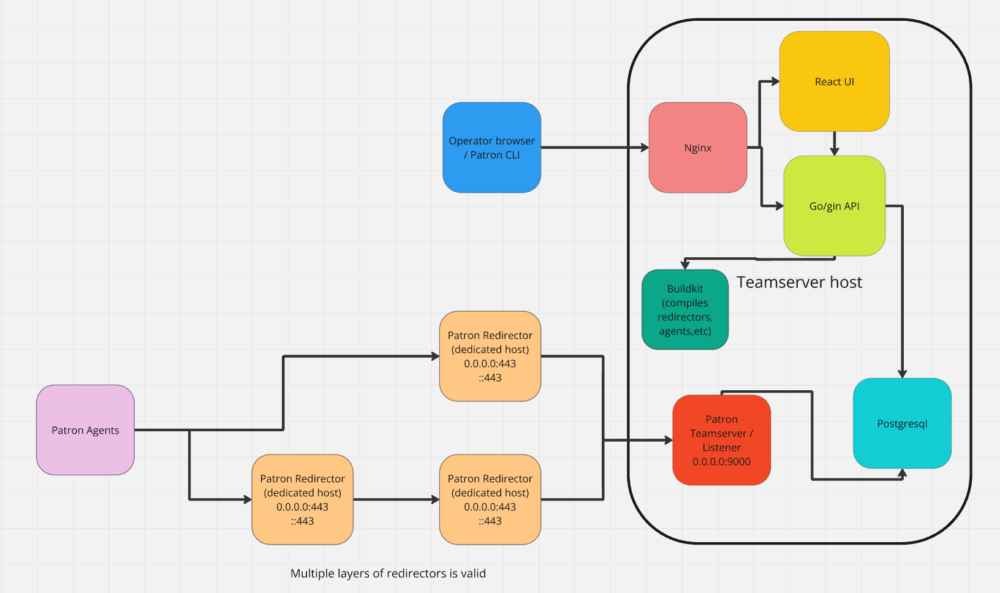

# Architecture

## Overview

All Patron C2 services, other than the agents, are run in individual docker containers. It is recommended to install Patron C2 on Ubuntu 22 or 24. We strongly recommend not running Patron on kali.

## Teamserver
### Overview
The Patron Teamserver is the main app, processing and tasking agents. By default, this app listens on port 9000 for incoming agents.
### Features
* Task agents to update their callback configuration
* Task agents to run commands on the target
* Task agents to send or receive files.
* Collects keylogs.
### Limitations
* Currently, the teamserver does not support IPv6 via the default installer.

## Postgres
### Overview
As you could probably guess, this is just a standard postgres container. By default, this app will listen globally on port 5432. The apps that connect to this are the API and Teamserver. The API maintains multiple connections to the database for faster authentication when processing requests.

## API
### Overview
The Patron API uses the golang gin framework, with JWT authentication. The authentication is built into this app.
### Features
* Many API endpoints to interact with agents.
* Manages roles of Patron users.
* Manage redirector builds / installs.
* Build new agents to run on target machines.
### Limitations
* Currently does not support IPv6 via the default installer. 

## UI
### Overview
The Patron UI is built using React.js.
### Features
* Search for agents by hostname and IP.
* Send commands to agents.
* Transfer files to and from agents.
* Build and view agent executables.
* Build redirector installers.
* Manage your own operator profile.
* Manage admin panel:
    * Manage new users.
    * Manage user roles.
    * Manage API and Teamserver settings.
### Limitations
* Currently does not support IPv6 via the default installer. 
* There are various bugs in the styling. The development team is aware. The v3 UI is slated for development in the near future to improve this, as well as reducing the UI startup time.
