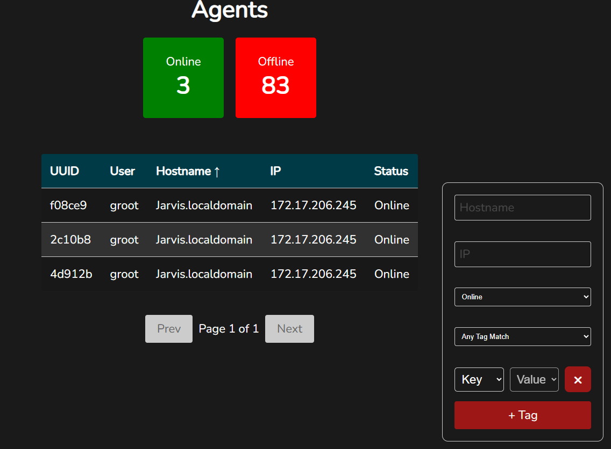

# Usage

## Getting Started
* Visit your server at `https://<your-ip>:8443`
* You will likely get flash-banged with the default light-theme. 

* In the top right, you can toggle to dark mode:

## Managing Users
* Getting your team onboarded to your C2 server should be the first thing you do, shared passwords are bad!
* In the Admin panel, go to "Create New User" tab and submit the form. Set the username, role, and initial password.

* From the "Existing Users" tab, we can edit or delete users. Modifying the initial user is forbidden from this panel.

* By selecting the "Edit" option for a user, we can modify the password and the role.

## Server / API Settings
* Currently, the Server and API only support modifying the logging configuration without restarting the container.
* From the "Server Settings" or "API Settings" tabs, configure the log level and max log file size:

## User Profile
* The Profile panel allows users to change their password and API keys.
* After a user is created, it is highly recommended for the user to change their password.

* API keys are created for authentication for the discord bot.
* Enter your password, and the desired max age of the API token:

* Direct Message your discord bot with `/patron configure <your-api-token>`

## Redirectors
* To install a redirector, create a fresh server. Either install docker first, or use ubuntu 22/24 to use the automatic installer.
* It is suggested to have IPv6 configured already. Ensure an IPv6 address appears when running `hostname -I`
* From the Redirector panel in the UI, go to the Create New Redirector tab.
* Set the Redirector Name, Description, and Listen Port.
* Unless chaining multiple redirectors together, do not use the Forward IP and Forward Port options.

* Once you click "Create Redirector", a download will start for a `redirector_install.sh`
* Save this script locally.
* Run this script on the server you created to run the redirector on.
* After a few seconds, you should see your redirector online in the "Existing Redirectors' tab.

## Payloads
* Once a Redirector is created, it is time to create an agent to call back to this redirector
* In "Create New Payload" tab, set the Payload Name and Description
* Set the Type per your desired OS and if you desire the keylogger. For linux, the keylogger version requires root. The Windows payloads do not require root. However, the keylogger is only per-user.
* Set the Listener IP to the IP of your redirector.
* Set the Listener Port to the IP of your redirector.
* Set the Call Back frequency to the desired number of seconds.
* Set the Call Back Jitter to the destired %. It is suggested anywhere from a 50-90% jitter.
* Unless debugging, keep Enable Logging to False.
* If desired, enable the Compression.
* Hit "Create Payload". This will take some time, but you will receive a notification upon completion.

* Payloads can be downloaded via the links on the "Existing Payloads" tabs.

* It is generally suggested to deploy the redirector as a service, but it can be ran via cron, .bashrc, or any other mechanism of starting a process.

## Agents
* In the home tab, we can now see our agent!

* To interact with the agent, click on it.

## Searching
* To search for agents, use the filters on the right side of the table.
* Search by Hostname, IP, or tags.
* When filtering by tags, use either
    * "Any Tag Match" to OR all selected tags.
    * "All Tags Must Match" to AND selected tags.
 

### Commands
* For linux agents, the default shell is bash.
* For Windows agents, the default shell is powershell.

* The Commands Tab also serves to manage the SOCKS5 proxy module
* Switch the command type to Socks

* Enter the desired port number, then click "Send" to task the agent to start the proxy module.
* Use the proxy via proxychains, or any other tool to use SOCKS5 proxies.
* To stop the SOCKS5 proxy, send a Socks command "disable".
 
### Files
* Agents can either send or receive files from the target machine.
* To receive a file, set the "Path", but do not select a file.

* Once the agent is done downloading the file, we can download it to our local machine

* To upload files, set both the "Path" and upload a file.

### Keylogs
* The Keylog tab is exactly what it sounds like, keylogs from the target machine.

### Configuration
* The configuration tab allows the agent to switch between redirectors, and update the callback frequency. This is useful if you need to interact with an agent and don't want to wait many minutes for each callback.
* Update the desired option, then click "Save"

### Notes
* The notes tab is a place for the operator to notes on this agent. These notes are per-agent, not per-host.

### Tags
* The tags tab allows you to put identifiers for your agents.
* This feature is under development. Search by tag is not supported yet.

