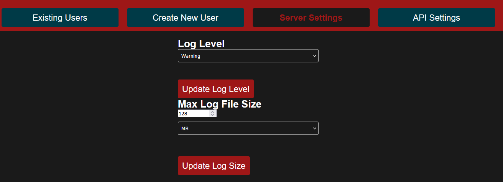

# Usage

## Getting Started
* Visit your server at `https://<your-ip>:8443`
* You will likely get flash-banged with the default light-theme. 

* In the top right, you can toggle to dark mode:

## Managing Users
* Getting your team onboarded to your C2 server should be the first thing you do, shared passwords are bad!
* In the Admin panel, go to "Create New User" tab and submit the form. Set the username, role, and initial password.

* From the "Existing Users" tab, we can edit or delete users. Modifying the initial user is forbidden from this panel.

* By selecting the "Edit" option for a user, we can modify the password and the role.

## Server / API Settings
* Currently, the Server and API only support modifying the logging configuration without restarting the container.
* From the "Server Settings" or "API Settings" tabs, configure the log level and max log file size:

## User Profile
* The Profile panel allows users to change their password and API keys.
* After a user is created, it is highly recommended for the user to change their password.

* API keys are created for authentication for the discord bot.
* Enter your password, and the desired max age of the API token:

* Direct Message your discord bot with `/patron configure <your-api-token>`